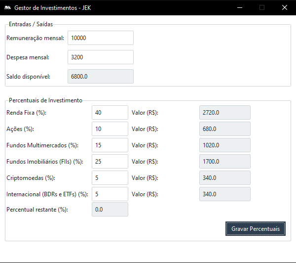

# InvestRatio 

**InvestRatio** is a simple desktop application built with Python and Tkinter (using `ttkbootstrap`) designed to help users organize their investments based on custom-defined percentages. This tool simplifies portfolio management by providing a clear overview of your asset allocation.

## Installation
1. Clone the repository: `git clone https://github.com/joaokrieger/invest-ratio.git`
2. Create and activate a virtual environment: `python -m venv venv` && `venv\Scripts\activate`
3. Install dependencies: `pip install -r requirements.txt`

## Running the Project
Development mode: `python main.py`

## Generating an Executable (.exe)

Use the following command in your terminal: 
`pyinstaller 
--noconfirm 
--name "InvestRatio" 
--icon=src/image/icon.ico 
--add-data "src/image;src/image" 
--add-data "src/data;src/data" 
--windowed main.py`